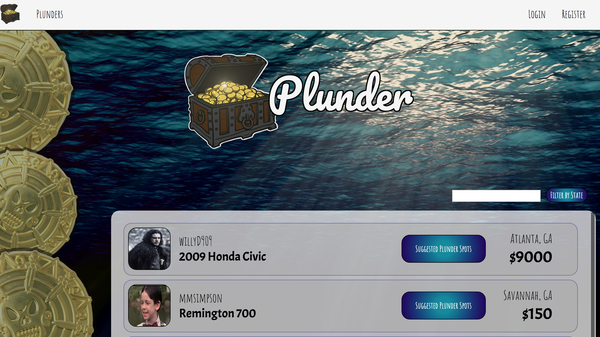

#  Plunder 
#### An app creating an on-line marketplace for users that places a high value on the safety of users while they conduct their e-commerce transactions.

When developing the concept behind plunder, I thought about the endless possibilities that a service like Craigslist offers paired with my hesitance to utilize them.  I choose not to frequent Craigslist because I have heard too many stories about purchase arrangements leading to less than shady transactions.  I wanted to offer a similar service that placed a higher emphasis on providing safe places for the e-commerce transactions to take place.

This was a group project developed by:
* Matthew Marberry (myself)
* Marshall Simpson

In this project I had a wide array of responsibilities including but not limited to:
*#### Concept Development
*#### Design Oversight:
    * Logo Development
    * Design of front-end interface
*#### Google Maps API integration
    * Creating geocodes
    * Querying a list of results based on location
    * Front-end placement of the map
*#### JSON Webtokens
    * Encryption and storing of user data
    * Back-end verification of webtokens
*#### Backend Server Router Patterns
    * Developing RESTful requests used to receive data from out server

Throughout this project both Marshall and I ran into several challenges and hurdles, but we were able to work together to overcome these issues.  I'm going to speak about some of my personal struggles in regards to developing the Plunder App.

My two main struggles in developing this project were in regards to:
1. Google Maps Back End Integration.
2. JSON Webtokens for user database.

## Google Maps Integration:

